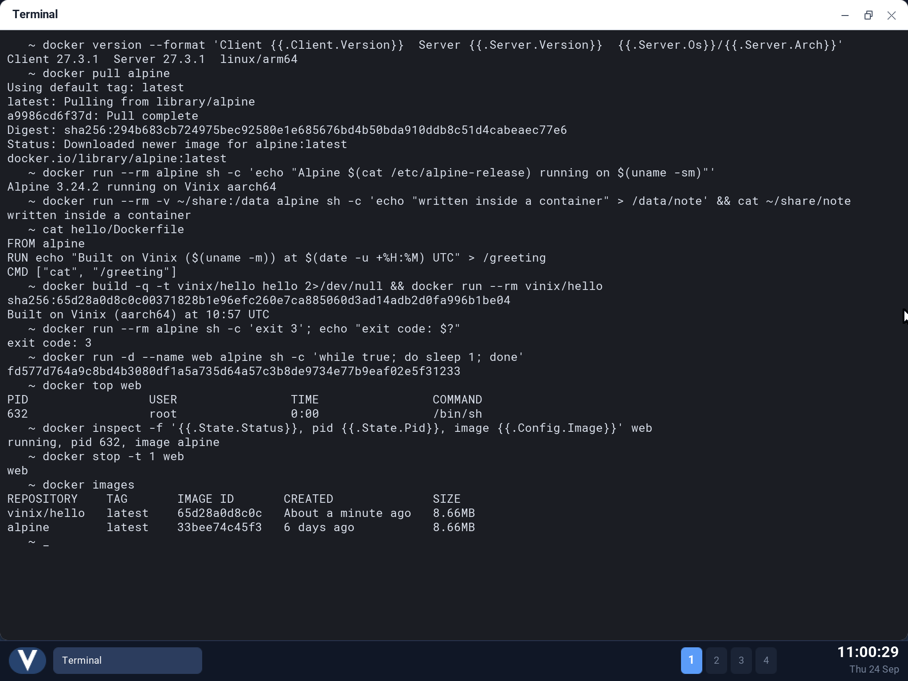
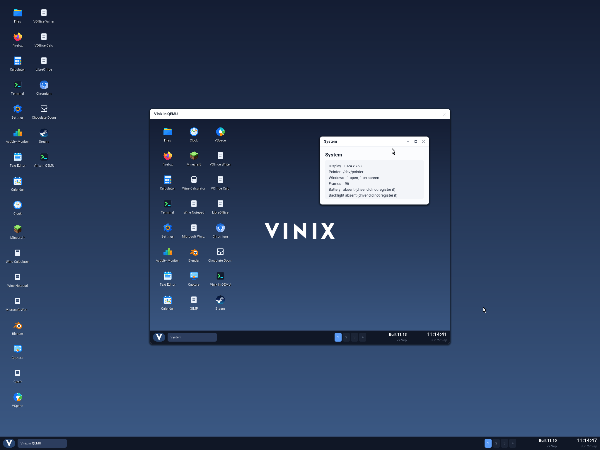
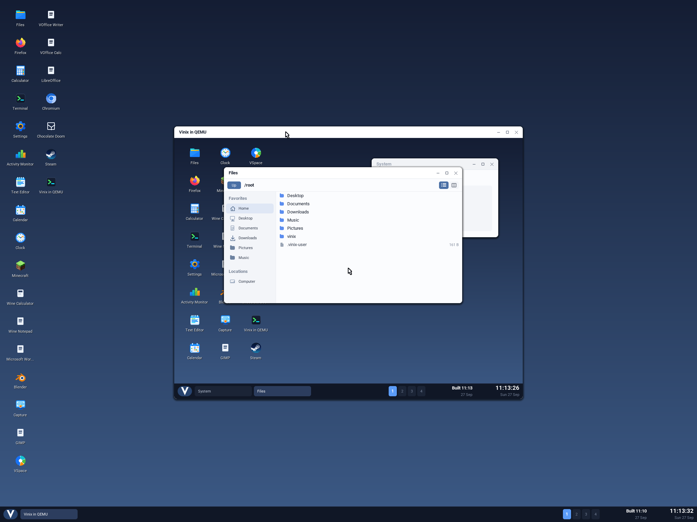

# Docker and QEMU now run on Vinix

Welcome to the Vinix blog. This is where we will post news about
[Vinix](https://vinix-os.org), the operating system written in [V](https://vlang.io).

The first post covers two milestones from the last few days: Docker now runs on Vinix, and so
does QEMU. With QEMU, Vinix can boot another Vinix.

## Docker

This is the stock Docker engine from Alpine Linux: dockerd 27.3.1, containerd 2.0 and runc 1.2,
running on Vinix on arm64. Vinix runs Alpine's arm64 binaries as they are, so none of it was patched
or rebuilt. The work was all on the kernel side: implementing the parts of Linux that a container
runtime relies on.

The screenshot shows the Vinix terminal pulling `alpine` from Docker Hub and running it. It also
writes to a bind-mounted volume, builds an image from a Dockerfile, and passes a container's exit
code back to the shell. Finally it runs a detached container, looks at it with `docker top` and
`docker inspect`, and stops it.

To get there, the Vinix kernel gained:

- **Namespaces:** mount, UTS, IPC, network, PID, cgroup, user and time namespaces. `clone`,
  `unshare` and `setns` handle them, and each process's namespaces show up under
  `/proc/<pid>/ns`.
- **A mount tree for each namespace:** bind, move and remount, `chroot` and `pivot_root`.
  Read-only mounts are honored, so `--read-only` and `:ro` volumes work.
- **cgroup v2** at `/sys/fs/cgroup`. The kernel enforces `cpu.max`, `pids.max`, `memory.max` and
  `cgroup.freeze`, so `--cpus`, `--pids-limit`, `--memory` and `docker pause` do what they say.
- **An overlay filesystem**, so Docker can use its default overlay2 storage driver. Before it,
  Docker had to fall back to a driver that copies every layer: `python:3.12-alpine` took 122 MB
  with that driver and takes 53 MB now. Starting a container no longer copies anything.
- **seccomp** BPF filters, so containers run under Docker's default seccomp profile.
- Smaller pieces:
  - capabilities;
  - sealed memfds (runc re-executes a sealed copy of itself);
  - `openat2` resolve flags;
  - FIFO opens that block, which runc's create/start handshake needs.

Alpine is not the only image that works. The Ubuntu, Debian, Node, Python, Go, nginx, PostgreSQL,
Redis, MariaDB and RabbitMQ images run too, and the test suite starts 100 containers in a row.
Getting them all working also fixed bugs that had nothing to do with containers. Signals now reach
threads that never make a syscall; Go's scheduler relies on that. `brk()` works again, and
CPU-time clocks are reported properly.

Docker still runs without its bridge network and iptables rules. That's next.

## QEMU, and Vinix inside Vinix

QEMU 9.1.2, Alpine's `qemu-system-aarch64`, now runs on Vinix too. It uses TCG, QEMU's software
CPU emulator, because Vinix can't give it hardware acceleration on arm64 yet. That is enough to
boot a second Vinix kernel.

In the screenshot, the outer Vinix desktop has opened **Vinix in QEMU** from the Start menu. The
app starts QEMU with a 1024×768 VNC display and shows it in a normal Vinix window, using a small
VNC viewer built into the desktop. Inside the window, a second Vinix has booted to its own desktop,
with its own taskbar, clock and build time.

The screenshot is itself taken from a VM. The outer Vinix runs in QEMU on an M1 Mac, using Apple's
Hypervisor.framework. So the inner desktop is two levels deep: macOS runs QEMU with hardware
virtualization, that QEMU runs Vinix, and that Vinix runs QEMU with TCG, which runs Vinix.

The nested desktop is not just a picture. It takes keyboard and mouse input, and its apps work.
Here is the Files app, running in Vinix, running in Vinix:

TCG translates guest code into host code as it runs, so QEMU needs memory that is both writable and
executable. Vinix refuses such mappings by default. The `vinix-qemu` launcher opts QEMU into them,
and only QEMU.

Running Vinix inside Vinix is more than a party trick. QEMU is a demanding program: it uses
threads, signals, timers, large memory mappings, runtime-generated code and sustained CPU load all
at once, so it tests the whole system. The natural next step is hardware-accelerated guests on
arm64, so that the inner Vinix doesn't have to be emulated.

To try it yourself, follow [docs/qemu-nested.md](https://github.com/vlang/vinix/blob/master/docs/qemu-nested.md)
in the Vinix repository. For Docker, build the Docker layer with `./build-docker-aarch64.sh`, then
run `vinix-dockerd start` in the Vinix terminal.

Vinix is still pre-alpha, and there is a lot left to do. If you'd like to help, the code is at
[github.com/vlang/vinix](https://github.com/vlang/vinix), and we're on
[Discord](https://discord.gg/S5Nm6ZDU38).
