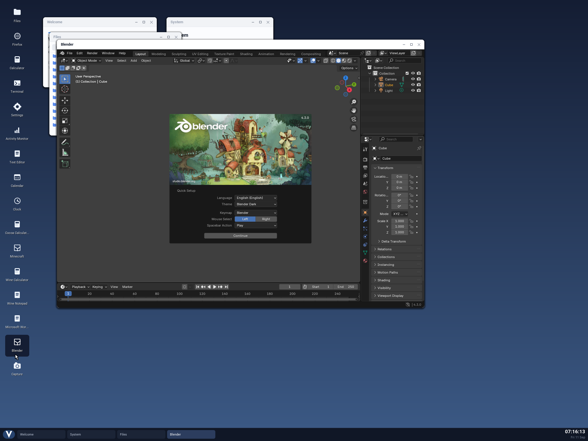

Blender now has a native Vinix window backend. Its interface appears inside a window
managed by the Vinix desktop, and the application sends pixels and receives input directly
through our compositor's shared-surface protocol. This path does not start an X11 or
Wayland server.



The screenshot shows Blender 4.3.0, built for ARM64 and musl, running on Vinix in QEMU.
Blender draws its own menus, editors and startup screen. Vinix supplies the surrounding
window, title bar, taskbar entry and desktop.

## Where the port fits

Blender has a platform abstraction called
**[GHOST](https://github.com/blender/blender/blob/v4.3.0/intern/ghost/GHOST_ISystem.hh)**.
It handles the parts an application needs from its window system: creating windows and
graphics contexts, receiving events,
and presenting images. Blender's editors sit above that boundary.

We added a `WITH_GHOST_VINIX` backend there. The native build enables OpenGL and disables
the X11, Wayland and SDL window backends. The build script checks the resulting executable's
architecture and direct library dependencies, and rejects an unexpected window-system
dependency.

An earlier Blender integration used a private Xvfb display, with the desktop hosting its
X11 surface. The native backend connects GHOST to Vinix's own surface and input protocol
instead. Blender's existing interface and rendering code remain responsible for what
appears inside the window.

## From OpenGL to a desktop window

The desktop starts Blender with a shared-surface file path, a width and height, and a pipe
for input. Neither `DISPLAY` nor `WAYLAND_DISPLAY` is supplied. Mesa's EGL runtime creates
an offscreen pixel buffer, or **pbuffer**, without a display-server connection.

Blender draws into that buffer with OpenGL. When it presents a frame, the Vinix GHOST
backend waits for the drawing to finish, reads the pixels, reverses their row order, and
copies them into the shared surface. The row reversal accounts for OpenGL and the desktop
using opposite vertical origins.

Our `VSF1` surface format has a small versioned header describing the dimensions, pixel
format and buffer ownership, followed by two pixel buffers. Blender writes the next image
into one buffer and publishes it only after the copy is complete. The compositor claims
the buffer it is displaying; if Blender's next target is still being read, it drops that
frame rather than modifying those pixels under the compositor.

The desktop validates the surface header and sizes before reading its pixels. It then
draws the finished image inside the window it owns. This is a shared-memory presentation
path with pixel readback and copying. Mesa still provides OpenGL and EGL; in the QEMU
configuration shown here, rendering uses the CPU through llvmpipe.

The [backend and protocol](https://github.com/vlang/vinix/tree/master/build-support/blender)
and the [compositor's surface reader](https://github.com/vlang/vinix/blob/master/desktop/vinix_surface.v)
are in the repository.

## The bug in the first frames

Getting a graphics context was only part of the work. Our first presentation path made
two assumptions that did not fit the way Blender draws.

Blender renders editor regions through offscreen framebuffers. Reading whichever
framebuffer happened to remain selected could capture the last region instead of the
composed window. We now explicitly select framebuffer zero as the read source before
copying the window's pixels.

The other problem was swapping the EGL pbuffer after presentation. Blender often redraws
only regions that changed, expecting the rest of the image to survive. A swap could discard
the previous contents, leaving the next partial redraw with an incomplete picture. Our
presentation now keeps the pbuffer intact and publishes a copy of it. Subsequent region
updates build on the image already there.

Those changes landed in the
[framebuffer presentation fix](https://github.com/vlang/vinix/commit/40acd227bae96c1a10df134a2597fd242c874bcc),
which also added the native-backend screenshot above.

## Input goes back the other way

The compositor sends pointer movement, left/middle/right button presses and releases,
wheel movement, and keyboard text through a pipe. The GHOST backend converts those
records into Blender events.

The rendering surface is currently fixed at 1280×900. Resizing or maximizing its outer
Vinix window scales that surface, and pointer coordinates are translated back into the
original dimensions. It does not yet ask Blender to lay out its editors at a new render
size. Closing the window closes the input pipe, which tells the backend to request
Blender's shutdown without making the compositor wait for it.

There is more platform work ahead. Keyboard input currently includes text and basic
navigation/control keys, with incomplete modifier handling. Clipboard integration, cursor
warping, input methods and additional top-level windows are unfinished. Audio is disabled
in the desktop launcher. The screenshot establishes the native interface and presentation
path; we have not qualified a complete modeling or rendering workflow.

## Building it

The native executable is built from the pinned Blender 4.3.0 source with Alpine's musl
patches and our GHOST backend. Run the builder from the Vinix checkout in an
**Alpine 3.21 ARM64** environment, as root so it can install its build dependencies:

```sh
./build-blender-native-aarch64.sh
```

With the dependencies preinstalled, set `VINIX_BLENDER_SKIP_APK=1` to build without root.

If that is a separate build machine, copy its `build-aarch64-blender-native/staging`
directory to the same location in the checkout used to assemble the desktop image. The
full desktop builder picks up the native executable automatically; compact images omit
this layer:

```sh
./build-desktop-aarch64.sh
./run-desktop-aarch64.sh
```

Inside Vinix, install the shared data and runtime libraries with `pkg install blender`,
then open **Blender** from the desktop. That entry starts the native executable; the
ordinary `blender` shell command remains the Alpine package's executable, useful for
background jobs. The
[build guide](https://github.com/vlang/vinix/blob/master/build-support/blender/README.md)
describes the staging arrangement.

The package smoke test separately checks that Alpine's Blender can save a `.blend` file in
background mode. Tests for the desktop cover shared-surface pixel reading and mouse
button and wheel records. They exercise different parts of the integration, so we keep
their results separate from what the native GUI screenshot demonstrates.

This gives us a concrete window-system boundary for an OpenGL application: a finished
image in shared memory, input records in a pipe, and window management in the compositor.
There is plenty left to implement around that boundary, but Blender's native window is
already a useful example to build on. The code is at
[github.com/vlang/vinix](https://github.com/vlang/vinix).
