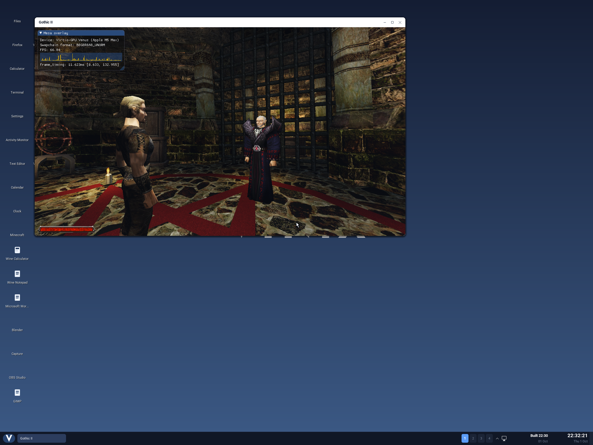
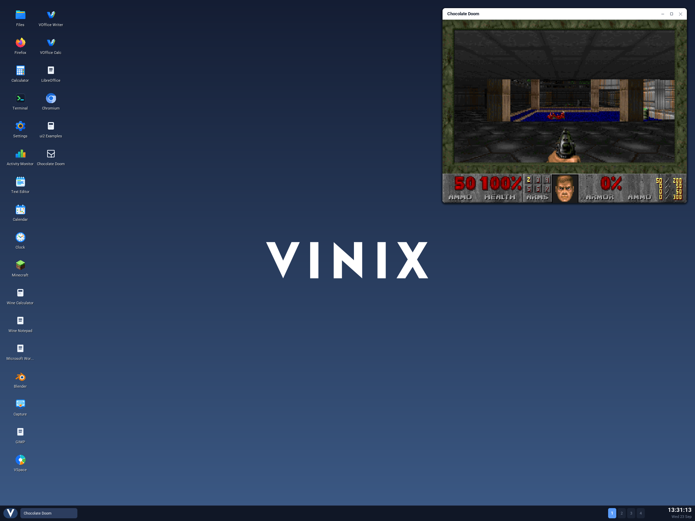
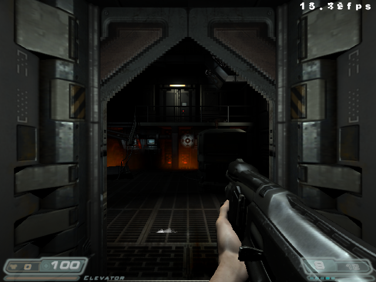
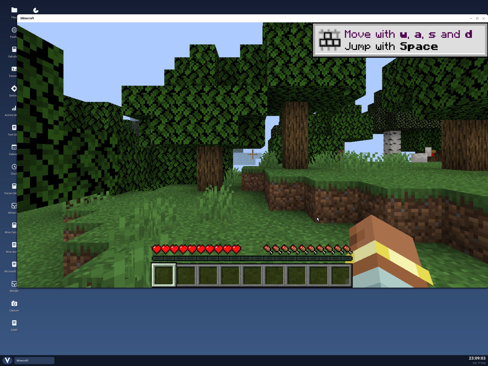

Vinix now runs DOOM, the DOOM 3 demo, Gothic II's demo through OpenGothic, and the official
Minecraft: Java Edition client. Gothic II now uses the host GPU through Vulkan: its opening
scene reached a median 83.45 FPS at 1280×720 on an Apple M5 Max.

These tests run on the ARM64 Vinix kernel in virtual machines on Apple Silicon. DOOM, DOOM 3
and OpenGothic use native ARM64 builds of open source engines; Minecraft uses Mojang's Java
client with ARM64 native libraries. Getting them working meant fixing graphics, sound,
clocks and the way idle virtual CPUs wait.

## Gothic II: from two frames a second to GPU rendering



[OpenGothic](https://github.com/Try/OpenGothic) reimplements the Gothic II: Night of the Raven
engine and uses the original game's assets and scripts. We cross-built it for ARM64 and
musl, then connected its X11 window to the Vinix desktop. It appears as a movable Gothic II
window, with keyboard and mouse input forwarded to the game. No Wine or x86 translation is
involved.

The first build got as far as the menu. Loading the world crashed the Vulkan renderer. We
started with Mesa's Lavapipe, which renders Vulkan on the CPU, and found two problems in
the engine's Tempest graphics library. Its descriptor-set fallback tried to update shader
bindings that were absent from the set layout. It also rejected sampling a render target
unless the format supported blitting, even though that extra capability was needed only
for generating texture mipmaps. Fixing both let Lavapipe draw the world.

That was a useful first step, but the opening scene ran at only one or two frames a second
on four QEMU cores. The next step was to give the engine a GPU.

We use Mesa's **Venus** driver, which sends Vulkan work from the guest to the host through
VirtIO-GPU. The host side runs in our KekVM setup's QEMU graphics
stack, with virglrenderer and the KosmicKrisp Vulkan-on-Metal backend. The Apple GPU does
the rendering; Vinix runs the game and manages its guest-side graphics resources.

For this to work, Vinix gained the modern PCI VirtIO-GPU transport, GPU contexts,
host-visible shared buffers and their memory mappings, and fence descriptors that tell
programs when GPU work has finished. Buffer ownership also has to survive exported file
descriptors and mappings, so closing one handle cannot free memory that another user still
needs.

We patched Venus to discover Vinix's render device without Linux sysfs and to present
completed images through Xvfb's shared-memory extension. Xvfb supplies the game's X11
surface, which the native desktop displays. A presentation worker waits for each image's
GPU fence and copies it while the game prepares the next frame.

CPU scheduling mattered too. We limited the engine's workers to the guest's CPU count,
removed unnecessary real-time scheduling from its silent audio mixer, and let idle virtual
CPUs sleep. We also prepared a private QEMU copy that permits shorter host sleeps;
otherwise short Venus waits kept CPUs busy and competing with the rendering work.

The measured result was **83.45 FPS median over 60 seconds**, after a 10-second warmup, at
1280×720 with four virtual CPUs and 12 GiB of guest RAM on an Apple M5 Max. Other compiler
jobs were running on the host, so individual samples varied considerably. This validates
the demo's opening scene and movement input; we have not tested a complete playthrough.
Audio is disabled, as are ray tracing, global illumination, mesh shaders and antialiasing.
The [measurements and validation](https://github.com/vlang/vinix/blob/master/tests/opengothic/venus-results.md)
and [graphics implementation](https://github.com/vlang/vinix/blob/master/build-support/venus/README.md)
are in the repository.

## DOOM: a desktop window, music and sound



For the original DOOM we use [Chocolate Doom](https://www.chocolate-doom.org/), a source port
that preserves the original game's behavior. Our ARM64 build uses SDL2 and SDL2_mixer.
It renders into a private Xvfb display, and the desktop shows that surface in an ordinary
movable window. The same hosting code is used for several other applications.

Even input needed care: a key press and release forwarded too quickly could fall between
the game's ticks and disappear. Holding forwarded taps long enough for the game to sample
them made the controls reliable.

Music and sound effects work too. SDL's OSS backend writes to Vinix's `/dev/dsp`, which
feeds the new ARM64 VirtIO sound driver. That work included negotiating sample formats,
rates and channels, handling the ioctl values musl passes, and pacing writes against the
virtual sound card's completed playback buffers. We also fixed writes interrupted by
handled signals so SDL would not mistake them for a lost sound device. The sound tests
record the VM's output to a WAV file to check the whole path.

This gives other SDL applications a working audio route as well. The
[desktop build instructions](https://github.com/vlang/vinix/blob/master/desktop/README.md)
explain how to stage Chocolate Doom with a local WAD and open it from the desktop.

## DOOM 3: a game that found a clock bug



DOOM 3 runs through [dhewm3](https://github.com/dhewm/dhewm3), built natively for ARM64/musl.
We tested it with the original public Linux demo data and Mesa's llvmpipe OpenGL renderer.
Here the CPU does the rendering.

To compare Vinix with Linux, we recorded one gameplay scene and replayed the same
353-frame recording on Vinix and Debian 13. Both guests used the same engine, game library,
musl loader, Mesa and LLVM, with four virtual CPUs, 8 GiB of RAM and a 640×480 render
surface. Over seven measured runs, Vinix reached **13.0 FPS median**, against **14.5 FPS**
on Debian, about 10% below it. Sound was disabled. This is a stationary scene under software
rendering, and host load affects the numbers; it is not a whole-game benchmark.

The more useful finding was a reproducible timing bug. On the original kernel, 99 of 100
short clock measurements returned identical values. dhewm3's pause-loop calibration could
therefore see zero elapsed time. Vinix's precise ARM64 clocks now read the architectural
counter directly, while coarse clocks retain their tick snapshots.

We also found that a timer could count time that elapsed before it was armed and wake
before its requested deadline. ARM64 timers now store a counter deadline. Regression
checks compare clock advancement and absolute sleep and futex deadlines against an
independent counter reading.

The [DOOM 3 test documentation](https://github.com/vlang/vinix/blob/master/tests/dhewm3/README.md)
includes the raw measurements and commands for building and running the demo. It has its
own launcher and test harness; it can also run in an existing GLX-capable X11 session.

## Minecraft: the official Java client



Vinix also runs Mojang's own Minecraft: Java Edition client, including a single-player
demo world. Install it from the guest with `pkg install minecraft`, then open Minecraft
from the desktop. The package downloads the official client and assets and verifies their
hashes.

The Java code is portable, but its native libraries still need work. We supply ARM64 LWJGL
libraries from the matching release and load their glibc binaries through Alpine's
`gcompat`, alongside native audio libraries. We also patched a bundled libffi call to
replace a fortified glibc `snprintf` call with plain `snprintf`. The launcher uses Java's
direct fork path to avoid a helper-process handshake that Vinix does not yet implement.

The desktop version uses llvmpipe, and Java currently runs in interpreter mode with one
active processor while we resolve generated-code and SMP issues. Startup is slow, and we
recommend one virtual CPU and 10 GiB of RAM for this configuration. The demo needs no
account; full-game sign-in needs a launcher application ID approved by Microsoft. See the
[Minecraft instructions](https://github.com/vlang/vinix/blob/master/README.md#minecraft-java-edition-on-aarch64).

## Trying it

These games use optional build or package layers. With KekVM's GPU backend prepared
(`make setup-gpu` in its checkout) and the ARM64 cross-build prerequisites installed,
the accelerated Gothic II demo can be built and launched from the Vinix checkout:

```sh
./build-opengothic-aarch64.sh --demo
./build-venus-aarch64.sh
./build-desktop-aarch64.sh
VINIX_KEKVM_DIR="$HOME/code/kekvm" ./run-desktop-aarch64.sh --venus
```

Open **Gothic II** from the desktop or Start menu. The builder can also stage your own
Gothic II installation with `--game "/path/to/Gothic II"`; the
[OpenGothic build guide](https://github.com/vlang/vinix/blob/master/build-support/opengothic/README.md)
has the details. Original game assets remain separate from the source repository.

Games have been useful tests for Vinix because they exercise many parts of the system at
once. Each of these ports left us with improvements other programs can use: sound output,
more precise clocks, reliable deadlines, better virtual CPU behavior and accelerated
Vulkan graphics. There is still plenty to do. The code is at
[github.com/vlang/vinix](https://github.com/vlang/vinix), and we're on
[Discord](https://discord.gg/S5Nm6ZDU38).
