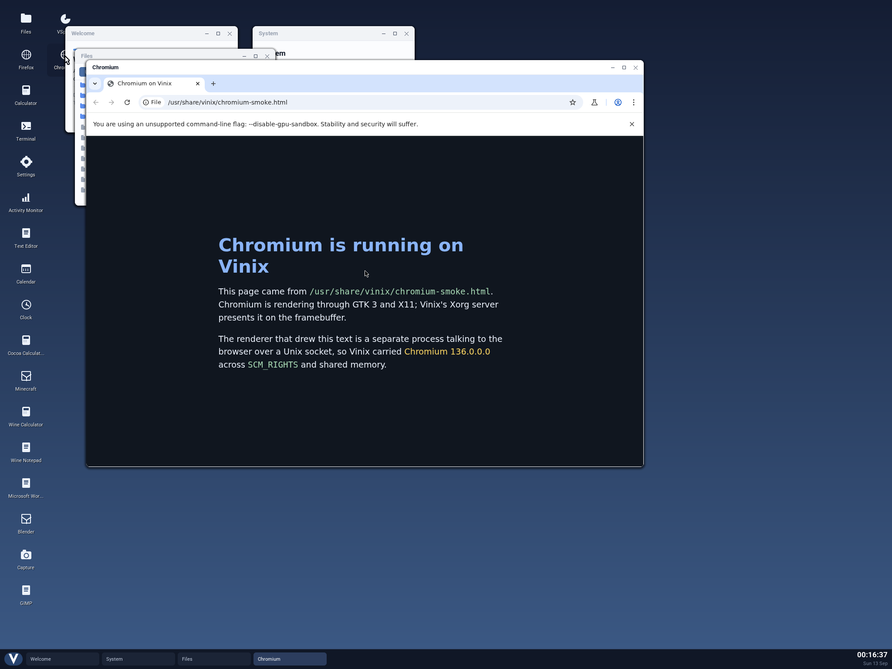

Chromium and Firefox have been useful teachers for Vinix. Running the real browsers
exposed gaps in procfs, Unix socket credentials, descriptor access modes and fault
handling. Later, a blank Firefox window led us to two more problems: conflicting LLVM
versions in the graphics runtime, and JIT mappings that our memory protection policy
refused.

Vinix is an operating system with a kernel written in V. Its Linux compatibility lets
us run Alpine's ARM64 browser binaries, with their existing libraries and process
models. The work described here comes from our September browser bring-up commits.
Those applications put several kernel interfaces together in ways that our smaller
programs had never exercised.



*Chromium rendering its local test page in a Vinix desktop window under QEMU.*


*Firefox rendering its local test page in a Vinix desktop window under QEMU.*

## A browser crash should end a process

Our first lesson was about what happens when an application deliberately aborts.

On ARM64, a userspace `BRK` instruction reached the fatal exception handler. That
handler dumped the registers and stopped the machine. `BRK` is used by
`__builtin_trap()` and by the failure paths of large C++ programs. A browser renderer
reaching a failed `CHECK` could therefore stop the entire operating system.

The [fault-handling fix](https://github.com/vlang/vinix/commit/25817c3ef3980fc45c77ae25665bd92957bc7045)
distinguishes exceptions from userspace from exceptions in the kernel. User breakpoints
produce `SIGTRAP`, undefined instructions produce `SIGILL`, trapped floating-point
exceptions produce `SIGFPE`, and memory faults produce `SIGSEGV`. If the process does
not handle the signal, that process ends. Its parent receives a signal-death status
through `wait(2)`, in the form that `WIFSIGNALED` and `WTERMSIG` expect.

Kernel faults still take the fatal diagnostic path. The distinction matters to any
application, but a browser makes it especially visible: renderers and helper processes
can fail independently, and the kernel has to preserve that boundary.

## `/proc` has to behave like a filesystem

We initially handled `/proc/self/exe` and `/proc/self/fd/N` by substituting paths during
`readlink(2)`. That was enough for a program asking for the name of its executable.

Chromium wanted more. It executes `/proc/self/exe` to start child processes. A child
also opens `/proc` and checks the link count of `/proc/self/task` through directory
operations to establish that it is still single-threaded. A special case in `readlink`
cannot supply an open directory, its metadata, and relative lookups through its
descriptor.

We added a [real procfs mount](https://github.com/vlang/vinix/commit/100411b14861ae328153abf3e421e8c132711fb5).
It supplied process directories with entries such as `cmdline`, `comm`, `stat`,
`statm`, `status`, `exe`, `task/` and `fd/`, together with system information used at
startup. The initial implementation was a subset of Linux procfs, with per-CPU
accounting left out and placeholders for some unavailable statistics.

There was another detail in the executable link. When a child starts through
`/proc/self/exe`, exec must record the actual executable's path. Recording the procfs
alias would make the child's own executable link resolve back to itself.

The initial tree was refreshed from the process table during filesystem lookups and
directory reads, using a procfs lock. That kept filesystem maintenance out of the
scheduler's clone and exit paths. Later commits expanded and refined procfs, but the
browser had already established the requirement: these paths need the behavior of
filesystem objects, beyond the strings returned by `readlink`.

## Crashpad needs credentials beside its descriptors

Chromium's crash handler, Crashpad, sets up a Unix socket pair, enables `SO_PASSCRED`,
and sends `SCM_CREDENTIALS` ancillary data beside file descriptors.

Vinix rejected the socket option with `ENOPROTOOPT`. It also rejected a `sendmsg`
containing the credential record with `EINVAL`. Chromium treated those failures as
fatal and aborted before opening a window.

The [socket change](https://github.com/vlang/vinix/commit/c7866e8020e4df6e2c7489b0652ee543be1fe82a)
added the option and credential control records. In that implementation, the receiver
gets the peer identity captured by the kernel when the connection was established,
also used for `SO_PEERCRED`. An attached credential payload is accepted without
trusting it as the sender's identity.

That distinction is part of the interface's purpose. Passing a descriptor transfers
access to an object; the receiving process may also need to establish who sent it.
Supporting the data bytes of a Unix socket was only part of what Chromium expected.
This fix addressed its startup handshake, rather than claiming every Linux credential
passing case was implemented.

## A missing access mode broke every graphical application

Another failure looked like an X server problem. Xvfb accepted a client's connection
and read its setup request, then dropped the connection. The launcher could report
only that the server had not become ready. Both browsers failed before their first
paint.

The cause was in descriptor creation. Sockets and several other anonymous descriptors
were created without an access mode. Since `O_RDONLY` is zero, their reads worked.
Their writes failed the access check with `EBADF`.

An X server replies to clients with `writev(2)`. The accepted socket therefore let it
receive the request while refusing the reply. The same defect affected other programs
using those descriptors, even though the browser launch was where we noticed it.

The [descriptor fix](https://github.com/vlang/vinix/commit/616f1610755a3bc605bc0ee2bd83da1467903126)
gave sockets, accepted connections and the affected anonymous descriptor types the
`O_RDWR` mode Linux exposes. Eventfd needed an additional correction: `EFD_SEMAPHORE`
shares a bit value with `O_WRONLY`, so passing eventfd flags straight into file flags
made a semaphore eventfd unreadable. Eventfd and timerfd creation now translate their
flags instead.

We added direct regressions for socket-pair writes, accepted connections and eventfd
I/O. A browser launch exposed the problem; small tests now check the underlying
contract without needing to start a browser.

## A window is not proof that a page painted

Once both browsers could draw their interfaces on the hosted X11 display, we also had
to improve what the tests called success.

Firefox creates a top-level window before drawing into it. A test that stops when the
window is mapped can pass while the user sees a blank rectangle. Our
[browser tests](https://github.com/vlang/vinix/commit/5957722854141485fb4059c4e148da173bc6a78a)
gained a profile that starts the real Vinix compositor, opens the browser through the
desktop, and waits for a surface with varied pixel values. Chromium's test also checks
that surface changes are accompanied by the bridge's drawing counter.

Even the pixel check needed care. Reading the framebuffer's backing file did not show
the live pixels that X had written into shared mapped pages. It could classify a
working browser as blank. The test now samples through a shared mapping, as the
compositor does, and reads sparsely so it does not spend its time contending with the
X server.

These are smoke checks for a visible, drawn browser surface. They do not establish
correct rendering of arbitrary websites or complete browser compatibility.

## Later Firefox failures crossed the kernel boundary again

A later Firefox build opened a window without drawing its page. Investigation found
two independent failures, recorded in the
[Firefox rendering and JIT fix](https://github.com/vlang/vinix/commit/ecd554ebca14f33294ffd8fab2aa55e310a1c3d3).

The parent process crashed while probing OpenGL. In the affected image,
`libgallium-24.2.8` and `libOSMesa` linked LLVM 19, while the DRI drivers linked LLVM
17. A GL client could load both into one process. Musl's handling of symbol versions
allowed references from one LLVM implementation to bind to definitions in the other.
LLVM 19's static constructors reached LLVM 17's `raw_svector_ostream::write_impl`,
which operated on incompatible data and attempted to write into LLVM 19's code.

For this browser configuration, we selected Firefox's software WebRender path and
disabled the GL/EGL, WebGL, DMA-BUF and hardware video paths that brought Mesa into the
process. This avoided the conflicting runtime libraries. It also means that this
configuration gives up WebGL and hardware video decoding; those paths still need
separate work.

The content processes had a different failure. SpiderMonkey requested JIT code pages
that were writable and executable at the same time. Vinix's **W^X** policy rejected
the mapping with `ENOTSUP`. Firefox reported the failed allocation as
`MOZ_CRASH(OOM)`, making a protection-policy mismatch look like an out-of-memory
condition.

Firefox already had an option for the behavior we needed:

```js
pref("javascript.options.content_process_write_protect_code", true);
```

With it, content processes switch JIT pages between writable and executable
permissions, as the parent process already did. We kept the kernel's W^X rule and
configured the JIT to work within it.

There had also been real memory pressure to address. Our private file mappings
eagerly copied pages, and musl initially maps a library's whole span before placing
its segments. Every Firefox process could copy all 130 MB of `libxul`, with another
145 MB of LLVM in processes loading Mesa. The
[demand-paging change](https://github.com/vlang/vinix/commit/e8c6ee25ad50870e941608a7fb0221af019e8bed)
left private file pages to be filled when first touched. Together with
[reclamation of unmapped pages](https://github.com/vlang/vinix/commit/d2e20abdeb1dabe9a1671ffc1c0bff380373b534),
the commit recorded Firefox starting in 1.5 GB during that bring-up.

With those memory fixes and the rendering and JIT preferences, the Firefox commit
recorded Firefox 140 loading its start page on ARM64.

## What we carry forward

The browsers exposed failures that crossed several interfaces: a socket accepted
connections but could not carry a reply; a procfs link could be read but could not
support a child's startup; a JIT reported OOM when the kernel had refused its
permissions. Following each failure to the actual syscall or mapping gave us a fix
that helped more than the application that found it.

The bring-up launchers still disable browser sandboxes, and the software Firefox
configuration has the graphics limits described above. A rendered start page is a
useful milestone, with more compatibility and security work ahead.

We now have both focused regressions for the kernel behavior and smoke tests through
the desktop people actually use. The implementation and its history are in
[vlang/vinix](https://github.com/vlang/vinix).
