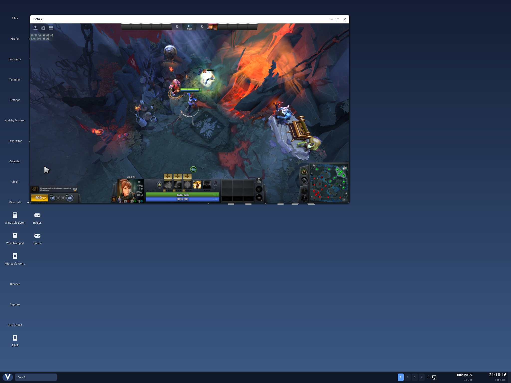

Dota 2 now runs on Vinix. Valve's Linux client loads a local map, lets us choose a team
and pick a hero, and reaches the start of a match inside a Vinix desktop window.



The screenshot shows Marci at the Dire base, with her model, health bar, courier and HUD
visible. Vinix supplies the desktop, title bar and taskbar; Dota draws the game inside the
window. The local server later entered the game-in-progress state, and the hero's gold
started to increase.

This is an early compatibility milestone. The verified map run uses software Vulkan
rendering, and it is far too slow for a normal match. We have not verified online
matchmaking or a complete playable game.

## Valve's Linux client on an ARM64 kernel

Our earlier game ports mostly used open source engines rebuilt for ARM64. Dota is
different: we run Valve's actual **Linux x86-64 executable** on the ARM64 Vinix kernel in
a virtual machine on Apple Silicon.

A native ARM64 build of QEMU's user-mode translator executes the x86-64 code. Vinix
provides the system calls underneath it. The game and its libraries use a private Debian
glibc runtime, separate from the Alpine musl libraries used by much of our native
userland. No Proton or Wine is involved in this path.

The game renders through Vulkan. For the map shown here, that means Mesa's **Lavapipe**,
which does the graphics work on the CPU. Its x86-64 driver and LLVM shader compiler also
run through the translator, so both the game and its software renderer pay the cost of
translation. A private Xvfb display supplies the X11 surface, which the Vinix desktop
hosts in a movable window and forwards keyboard and mouse input to.

Getting this far required work in the runtime, translator, graphics driver and kernel.
Several failures looked like game crashes until we reduced them to smaller tests.

## Getting the runtime to agree with the game

The first major problem was concurrent access to environment variables. The original
glibc 2.36 runtime could crash while one thread read the environment and another updated
it. A separate regression program reproduced the failure on Vinix. Replacing libc and
its matching loader with glibc 2.41 let that same program finish all 32 test rounds.

Steam's libraries presented another problem. Source 2 and the Steam client both expose
coroutine functions, but their implementations are different. Loading them in the wrong
order mixed the two implementations and crashed startup. Our launcher now loads the real
Linux Steam client before Source 2 and keeps it loaded for the process lifetime. That
resolved the measured symbol-binding and unload/reload failures without changing Valve's
loaded game code.

There were smaller library mismatches too: the game's bundled FreeType and audio decoder
were older than functions required by the distro dependencies. The launcher preloads the
matching runtime libraries while keeping the game's Pango libraries together.

## Two page sizes, one address space

The x86-64 program expects 4 KiB pages; this ARM64 Vinix configuration uses 16 KiB pages.
Several guest pages can therefore share one native page, and the translator has to
preserve the boundaries between them.

We found that QEMU's mapping path could accept a non-replacing mapping over an occupied
4 KiB guest page inside a 16 KiB native page and erase its contents. The translator now
checks guest-page occupancy under its existing mapping lock before doing that work.
Regression checks cover collisions, adjacent pages, reservations and retained contents.

A related issue affected `FUTEX_WAKE_OP`, a synchronization operation that writes to a
second memory address. QEMU can protect a native page because it contains translated
code, even when a neighboring guest data page is writable. A kernel write to that data
then failed with `EFAULT`. The translator now validates the guest permissions and
prepares the writable memory before the operation. The paired test reproduced the old
failure and completed 128 writes with the fix, with worker code execution acknowledged
between writes.

## Loading the map exposed a Vulkan bug

Rendering the main menu did not mean the map would load. The first local-map attempts
crashed in Lavapipe's compute descriptor-set handler: it dereferenced a null descriptor
set that the enabled Vulkan extension permits.

Simply skipping that set stopped one crash but moved the descriptor slots used by later
sets. The driver also had to preserve their positions. Our patched Lavapipe passes all
four modes of a focused compute test; Debian's driver and an unpatched build from the
same source crashed in the three null-set cases.

That change got us past the graphics failure and into the local server's team and hero
selection screens. The
[driver notes](https://github.com/vlang/vinix/blob/master/build-support/dota2/mesa/README.md)
and [regression tests](https://github.com/vlang/vinix/blob/master/tests/dota2/README.md)
describe the exact cases.

The game also helped expose storage problems. We serve the existing installation as a
read-only ext2 disk over NBD, avoiding another full copy of tens of gigabytes of assets.
Vinix's VirtIO block driver needed to negotiate and expose the disk's read-only status:
otherwise failed shader-cache writes could leave dirty pages that could not be evicted
and eventually break unrelated reads. We also fixed `fsync` so a failing unrelated disk
does not make a writable RAM configuration file report an I/O error.

## From hero selection to the Dire base

The software renderer made the first level load slow enough to time out Dota's loopback
connection to its own server. Increasing the client and server timeouts let that first
load connect.

In the successful run, we joined Dire by clicking its team card, picked Marci, clicked
**LOCK IN**, and used **SKIP AHEAD** in the strategy phase. The client drew the Dire base
about 13 minutes later. F1 selected the hero, and her model appeared on the map after
further rendering work. This run used an 854×480 game surface.

The remaining 83 seconds of pregame time took about 20 minutes of real time. Frames
ranged from fractions of a second to minutes, depending on the scene. That explains the
scope of this result: a rendered hero on a loaded map and a local match reaching its
start, with substantial performance work still ahead. The tests use Valve's anonymous
engine mode and real Steam client libraries; they do not establish authenticated online
play.

## The GPU path is still experimental

We also have an x86-64 Mesa **Venus** driver that sends the translated game's Vulkan work
through Vinix's VirtIO-GPU device to the Mac's GPU in our KekVM setup. The translator
passes through the required graphics ioctls. This separate path rendered Dota's startup
logo and main menu at roughly 5–10 FPS.

It is not ready for normal use. Both GPU runs that got past the menu were followed by a
restart of the Mac; one produced a WindowServer watchdog panic. We are investigating
that host-side failure. The screenshot above comes from the software-rendered map run,
and we have not verified a stable GPU-rendered match.

## Building and following the work

The optional Dota layer can be built from the Vinix checkout:

```sh
./build-steam-aarch64.sh
./build-dota2-aarch64.sh
./build-desktop-aarch64.sh --compact-initramfs --with-dota2
```

Supply the matching Linux game installation and Valve's actual Linux Steam client
libraries separately, then launch **Dota 2** from the desktop. The repository does not
distribute the game assets or a Steam account. The
[bring-up guide](https://github.com/vlang/vinix/blob/master/docs/dota2.md) covers the
runtime, installation export, probes and recorded results.

Dota has already helped improve memory mapping, synchronization, storage and library
compatibility in Vinix. Running a large existing application makes those boundaries
concrete: it needs all of them to work together before a hero can appear on the map.
The code is at [github.com/vlang/vinix](https://github.com/vlang/vinix), and development
discussion is on [Discord](https://discord.gg/S5Nm6ZDU38).
