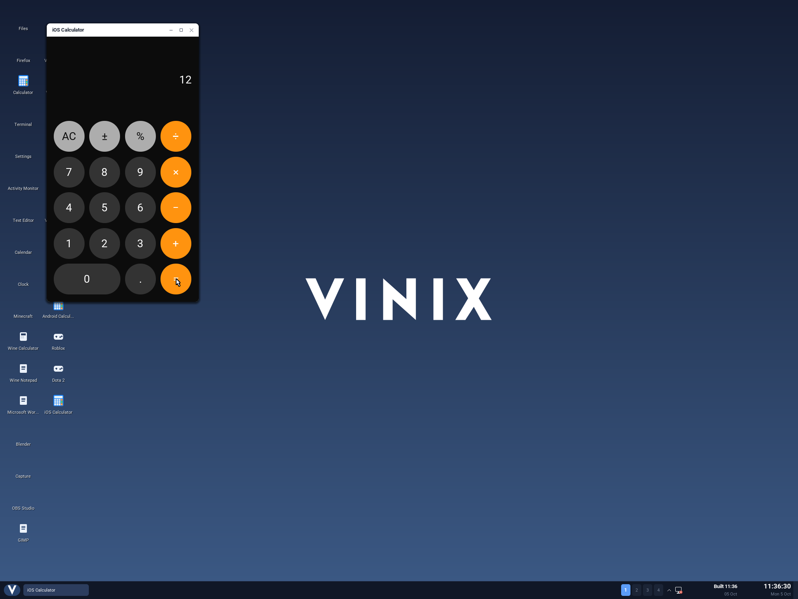

Vinix can now run an ARM64 iOS calculator binary in a desktop window. The app is
written in Objective-C and uses UIKit. Its compiled methods handle the buttons,
perform the arithmetic and update the display; Vinix supplies the APIs underneath.



This is a small first step toward iOS compatibility. The calculator is our own
[open-source test app](https://github.com/vlang/vinix/tree/master/examples/ios-calculator),
compiled as an iOS app. Apple's Calculator and arbitrary App Store apps do not
run through this layer yet. The screenshot comes from clicking the compiled app
inside an ARM64 Vinix virtual machine.

## Sharing a CPU is the beginning

Apple Silicon made it possible for Macs to execute iPhone and iPad machine code
without translating every instruction. Vinix also supports ARM64, so ordinary
ARM64 instructions can run directly. But an iOS executable expects much more
than a compatible CPU: Apple's executable format, loader, Objective-C runtime,
frameworks and application lifecycle.

Vinix normally runs ELF executables using its Linux-compatible system calls. An
iOS app is a Mach-O executable and calls functions in libraries such as
`libobjc`, Foundation and UIKit. We implemented the subset needed by this app in
V, with a small assembly bridge for the calling convention. We did not copy
Apple's framework implementations into the system.

The resulting path is:

```text
Vinix kernel loads the run-ios ELF executable
  → run-ios maps and links the iOS Mach-O
  → the app executes its original ARM64 methods
  → Objective-C / Foundation / UIKit calls enter the V runtime
  → the UIKit view tree reaches the Vinix desktop compositor
```

All compatibility work lives in userspace. This milestone required no Darwin
system calls or Mach-O loader in the kernel.

## Loading the executable

The V loader reads the Mach-O headers, selects an ordinary ARM64 slice from a
universal binary, validates its segments and finds the `LC_MAIN` entry point.
It reserves an address range, copies the file-backed segments and zeroes their
remaining memory. After linking, it applies the requested memory permissions,
including sealing read-only data and leaving gaps inaccessible.

Modern Mach-O binaries use chained fixups for pointers that need rebasing or
binding to imported symbols. Our loader understands the two ordinary 64-bit
pointer formats used by these builds. It validates each chain before writing
any relocated pointers, then binds the imports to functions and framework class
objects supplied by the compatibility runtime.

The format definitions are public: Apple's
[Mach-O headers](https://github.com/apple-oss-distributions/xnu/blob/main/EXTERNAL_HEADERS/mach-o/loader.h)
and [dyld chained-fixup headers](https://github.com/apple-oss-distributions/dyld/blob/main/include/mach-o/fixup-chains.h)
provided the starting point. Unsupported features produce a diagnostic rather
than being silently accepted. ARM64e pointer authentication, encrypted apps,
thread-local storage and general dynamic-library loading remain future work.

## Making Objective-C messages work

An Objective-C call such as `[calculator pressKey:key]` goes through
`objc_msgSend`. The receiver's class and the selector determine which compiled
method to call. The loader reads the app's class metadata and method lists,
registers its classes, and builds a lookup table of their method addresses.

If the method belongs to the app, dispatch jumps to that address in the mapped
Mach-O. If the method is supplied by the supported framework subset, dispatch
handles it in V. Superclass calls follow the same hierarchy. The implementation
also adjusts nonfragile ivar offsets when the runtime's superclass layout
requires it.

The bridge must preserve the arguments while V performs that lookup. ARM64
passes integers and pointers in general-purpose registers, floating-point
values in vector registers, and some structures as several floating-point
values. UIKit's `CGRect` is one example. The assembly trampoline saves those
registers, calls the lookup function, then restores them before entering the
app's method. It also preserves the register used for indirect structure
results. Apple's
[ARM64 ABI documentation](https://developer.apple.com/documentation/xcode/writing-arm64-code-for-apple-platforms)
and [Objective-C runtime structures](https://github.com/apple-oss-distributions/objc4/blob/main/runtime/objc-runtime-new.h)
helped establish those boundaries.

The app uses ARC, so dispatch alone is insufficient. The V runtime implements
retain, release, strong assignments and autorelease pools. When the final
reference disappears, it calls the compiler-generated ARC destructors and
releases the framework fields and child views owned by that object.

## From UIKit to a desktop window

The calculator uses `UIWindow`, `UIViewController`, `UIView`, `UILabel`,
`UIButton`, `UIColor`, `UIFont` and `CALayer`. Its native Objective-C code
constructs the interface, positions the controls and connects their target/action
callbacks. Our UIKit subset maintains those objects and their properties.

`UIApplicationMain` instantiates the app delegate and runs its launch callback.
When the app makes its window visible, the runtime invokes the controller's
native view-loading and layout methods. The resulting view tree is serialized
over the same pipe protocol used by standalone Vinix desktop applications. The
existing compositor draws the window, text and rounded buttons.

A click travels back through that protocol. The runtime finds the button's
target and selector and calls the app's original method. The calculator updates
its model and label, and the compositor receives the updated tree. Resizing also
calls the app's layout method. The desktop supplies the fonts, so typography
does not yet exactly match an iPhone.

## Building without an iOS SDK

On this Mac we had the command-line tools, but no installed iPhoneOS SDK. For
this small app, we supplied independent declarations for the required APIs and
linker stubs containing library and symbol names. Clang compiles the Objective-C
with an `arm64-apple-ios15.0` target, and `ld64.lld` links a normal iOS Mach-O
with imports from the Apple library paths.

Those stubs contain no implementation. The resulting binary relies on the
runtime to resolve its imports. The build also creates an `.app` bundle, applies
an ad-hoc signature and packages an `.ipa`. An installed iPhoneOS SDK can be used
instead; installing on a physical iPhone still requires the usual developer
signing and provisioning.

## Verifying the whole path

We checked the loader and runtime on the host with AddressSanitizer and
UndefinedBehaviorSanitizer, then ran the binary in an isolated Vinix QEMU guest.
The tests exercise 27 calculator cases, keyboard input, resizing and 1,000
repeated updates. Closing the app checks ARC teardown for remaining owned
Objective-C objects.

Finally, a separate test boots the actual Vinix desktop and sends QEMU pointer
events to the calculator buttons. Clicking **7**, **+**, **5**, **=** produces
**12**, as shown above. This checks the native binary, compatibility layer,
desktop protocol, rendering and input together.

To reproduce it after building the ARM64 userland sysroot:

```sh
./build-ios-aarch64.sh
./build-desktop-aarch64.sh
./run-desktop-aarch64.sh --no-build
```

Open **iOS Calculator** from the desktop. The
[bring-up guide](https://github.com/vlang/vinix/blob/master/docs/ios.md) describes
the supported ABI, build options, inspection commands and tests.

The next step is an existing open-source iOS application with a broader API
surface. Collections, blocks, gestures, resource loading, networking and Swift
will each expose another part of the platform contract. The calculator gives us
a working path from an iOS executable to a Vinix window against which to test
those additions.
