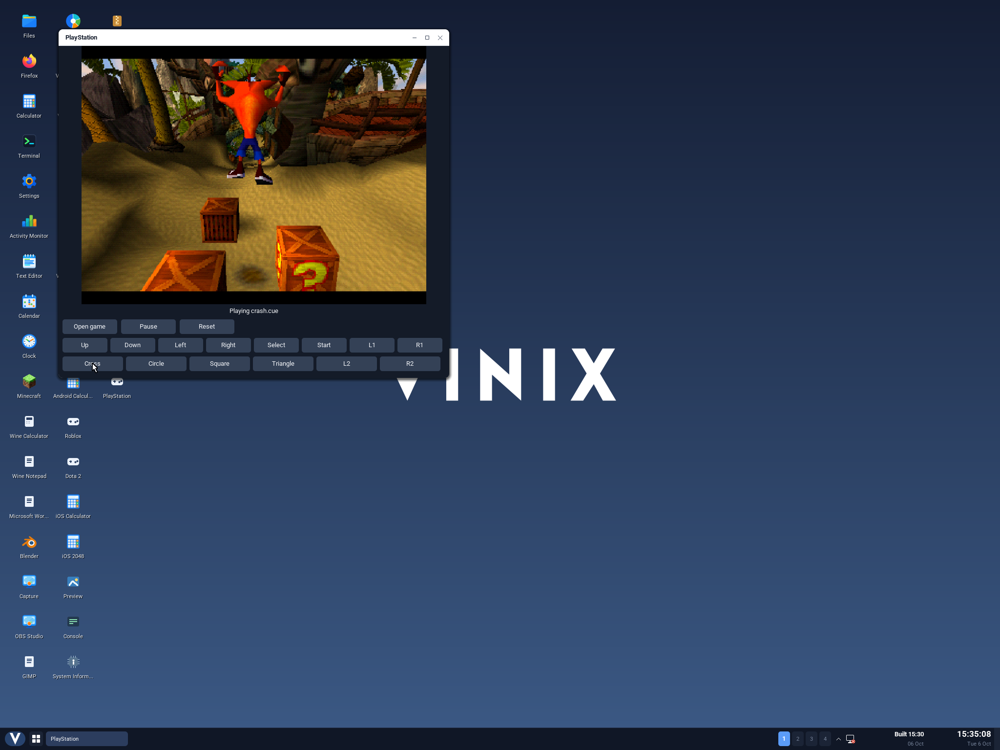

Vinix's ARM64 desktop can now run original PlayStation games in a native window. We
tested Crash Bandicoot's USA disc image through its title screen and island map
into N. Sanity Beach, then moved, jumped and spun through the starting crates.



The game runs through [PCSX-ReARMed](https://github.com/libretro/pcsx_rearmed),
an existing PlayStation emulator. We built its unchanged libretro core for
ARM64 and wrote a V frontend that connects it to Vinix's compositor, controller
input, audio device and files. The original game code and assets remain intact.

## Two instruction sets, one desktop

The PlayStation's CPU executes MIPS instructions. Our current Vinix desktop
build runs on ARM64, so the game needs an emulator between those two machines.
PCSX-ReARMed supplies the virtual console: its CPU, graphics, sound, CD drive
and controller interfaces.

The emulator itself is a native ARM64 program. Vinix's Linux-compatible system
calls let it open game files, allocate memory and map a shared framebuffer.
The game sees the emulated PlayStation hardware; the emulator sees Vinix.

The path from disc to desktop is:

```text
Original PS1 executable or disc image
  → PCSX-ReARMed executes MIPS code and emulates the console
  → V frontend receives game pixels and supplies controller state
  → shared framebuffer reaches the Vinix desktop compositor
  → game appears in the PlayStation window
```

PCSX-ReARMed offers several execution and rendering options. This first build
uses its **MIPS interpreter** and **NEON software GPU**. ARM's NEON instructions
help the emulator draw the console's graphics on the CPU. The host GPU does
not render the PlayStation scene.

We disable dynamic recompilation and asynchronous core workers in this build.
That keeps emulation on the frontend's calling thread and avoids executable
code generation while establishing the port. It also leaves performance work
for later: this result does not establish full-speed emulation across games.

## A small frontend around an existing emulator

Libretro defines the boundary between an emulator core and the program hosting
it. The frontend registers callbacks for video, audio, input and configuration,
loads the game with `retro_load_game()`, then calls `retro_run()` to advance
emulation.

Vinix uses that interface directly. The frontend and core are statically
linked with musl into one ARM64 executable, `vinix-ps1`. Our build pins the core
to revision `c8816799b50388e61cfe237fe2cdbb7d8175f20a` and verifies the downloaded
source archive with SHA-256. The integration uses the core's existing API and
build options without patching its source.

The V frontend speaks the same pipe protocol as standalone Vinix desktop
applications. It describes the game view, status text, **Open game**, **Pause**,
**Reset** and on-screen controller buttons. The compositor draws those controls
and sends clicks and keys back to the app. Each desktop poll advances one
emulated frame while the game is running. Pause stops those calls; Reset uses
the core's reset function.

This gives the emulator a Vinix window without an X11 server, Wayland server
or RetroArch installation. All the new PlayStation integration lives in
userspace.

## Getting the pixels onto the screen

The video callback receives the emulator's actual framebuffer, including its
dimensions, row pitch and pixel format. The frontend converts those pixels
into a 640×480 surface shared with the compositor through `mmap`.

The surface uses Vinix's existing VSF1 format and two pixel buffers. The
frontend writes the next frame into the available buffer, then publishes its
index with an atomic operation. The reader marker tells it which buffer the
compositor is using, so it avoids overwriting that buffer during presentation.

The window presents the surface at a 4:3 aspect ratio, adding dark borders
when needed. Resizing changes its presentation size. The polygons, textures
and animation inside the view all come from PCSX-ReARMed running the game.

## Buttons, sound and memory cards

Controller input takes the reverse route. A desktop event updates the
frontend's button state, and the core reads that state through libretro's
input callback. The current frontend exposes one standard digital pad.

Arrow keys or WASD control the D-pad; Z, X, C and V map to Cross, Circle,
Square and Triangle. Enter presses Start. Mouse presses can hold the on-screen
buttons. Keyboard events currently produce short button pulses through the
desktop's text-key protocol, so continuous keyboard input still has room for
improvement.

Audio samples go to Vinix's OSS-compatible `/dev/dsp` device as 44.1 kHz stereo
PCM when the device is available. Writes are nonblocking so audio cannot hold
up the desktop exchange. The regression runs use `--mute`; sound output has
not been verified by these tests.

The emulated primary memory card is a 128 KiB file under the active user's
`~/.local/share/vinix/ps1/saves`. Each absolute game path gets its own card.
The frontend restores it when loading the game and saves it every 300 emulated
frames, before reset or a game change, and during normal window close. It
writes a temporary file and renames it into place.

Both verified games used the core's high-level emulation BIOS. This implements
BIOS services inside the emulator and lets those runs boot without a Sony BIOS
file. HLE has compatibility limits; games that need firmware can use a supplied
BIOS in `~/.local/share/vinix/ps1/bios`. The
[upstream BIOS documentation](https://docs.libretro.com/library/pcsx_rearmed/#bios)
lists the supported filenames and explains the tradeoff.

## Testing with homebrew and Crash Bandicoot

The default build includes
[Tetrade 1.0](https://github.com/Logan-Campbell/Tetrade/releases/tag/v1.0),
Logan Campbell's MIT-licensed PlayStation Tetris game. We download the author's
original executable and BIN/CUE release assets, verify their hashes and keep
the license alongside them. This gives us a reproducible game for testing the
same emulation path used by a commercial disc.


The ARM64 QEMU regression boots Tetrade, checks that its pixels animate, and
compares neutral and controller-input frames at the same emulated age. That
last detail matters: a difference must come from the input, rather than simply
from sampling the animation later. The recorded run found 1,920 changed pixels
in an animation sample and 1,408 changed pixels after Right at an equal age.

It also verifies pause and resume, deterministic reset, memory-card persistence
across fresh emulator processes, and successful shutdown with the shared
surface removed. Both Tetrade's PS-X executable and its CUE/BIN disc boot
passed. A separate desktop test uses real QEMU mouse events to start Marathon,
pause its falling pieces, resume and close the window.

Crash Bandicoot was a separate trial using a supplied USA CUE/BIN image. It
reached N. Sanity Beach and responded to movement, jumping and spinning. Pause
kept every game pixel unchanged for 60 poll frames; after resuming and running
120 frames, 17,654 pixels changed. Another run opened the disc through the
desktop's **Open game** path prompt and exercised mouse and keyboard controls.

These runs verify the path from PS1 instructions to interactive gameplay in
Vinix. They establish compatibility for Tetrade and the tested part of Crash.
The frontend currently has no analog-controller, multiplayer, save-state or
disc-swapping controls.
Game speed follows the desktop polling cadence, and real-time performance
across other games remains unmeasured.

## Building and playing

From a Vinix checkout containing the PlayStation frontend, after building the
ARM64 userland sysroot:

```sh
./scripts/build-ps1-aarch64.sh
./scripts/build-desktop-aarch64.sh
./scripts/run-desktop-aarch64.sh --no-build
```

Open **PlayStation** from the desktop. Tetrade starts by default; press Start,
then Cross to select Marathon. To load another game, choose **Open game**, type
or paste its file path, and press Enter. Keep CUE sheets beside their referenced
BIN tracks. The core also accepts formats including CHD, PBP, ISO, M3U and
PS-X EXE, though those formats have not all been exercised by our regressions.

The build includes the emulator's GPL license and dependency notices. Tetrade
is the bundled game; commercial disc images and Sony BIOS files are supplied
separately.

The implementation is in `games/ps1`, with build inputs in `build-support/ps1`
and regressions in `tests/ps1` in the
[Vinix repository](https://github.com/vlang/vinix). PCSX-ReARMed does the
console emulation; Vinix supplies the native process, files, input and desktop
window that let it become a usable application.
